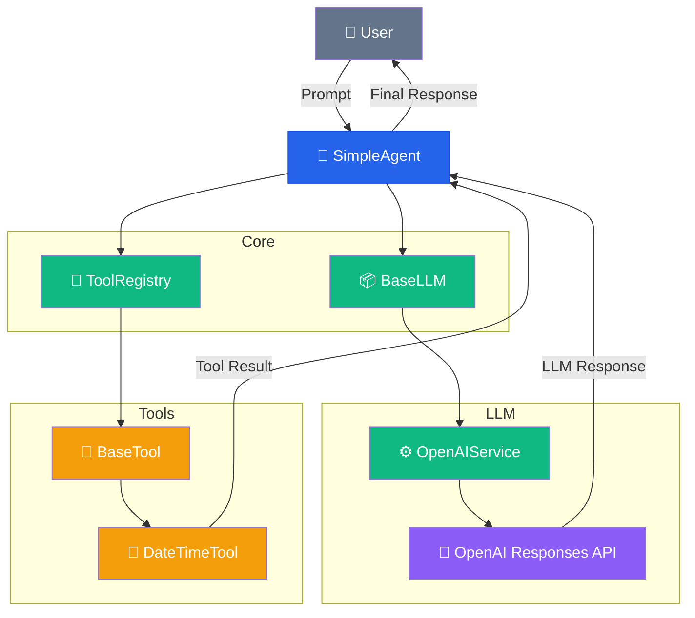
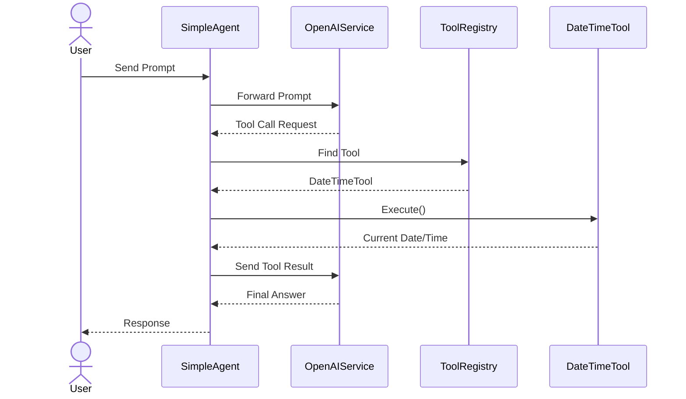

# 🤖 AI Agents Project

AI Agents Project is an educational framework built from scratch to explore the internal architecture of modern AI Agents. Instead of relying on existing frameworks such as LangChain or CrewAI, this project implements the core building blocks step by step, providing a deeper understanding of how autonomous agents work.

## Why this project?

Most AI Agent projects teach developers how to use frameworks.
This project focuses on understanding how those frameworks are built internally, implementing each architectural layer from scratch.

## ✨ Objectives

- Understand the architecture behind AI Agents

- Build an extensible agent framework

- Learn Tool Calling

- Explore software engineering practices

- Apply testing, observability and clean architecture

## 🏗️ SimpleAgent Architecture
The project follows a layered architecture, keeping the Agent, LLM providers and Tools loosely coupled through abstractions.



#### 🔄 Tool Calling Flow
The DateTime tool is a simple feature for testing the concepts involved in LLM calls.



## 🚀 Current Features

- Generic Agent architecture 
- Tool Calling 
- Tool Registry 
- Abstract Tool interface 
- Provider abstraction (BaseLLM) 
- OpenAI integration 
- Fake LLM for testing 
- Automated tests with pytest 
- Execution observability 
- Token usage metrics
- Short-term memory

## 🛠️ Tech Stack


<div align="center">


</div>

## Project Status

🚧 Under active development

Current module:
- ✅ Generic Agent
- ✅ Tool Calling
- ✅ Testing
- ✅ Observability
- ✅ Memory

Upcoming:
- 🔜 ~~Memory~~
- 🔜 RAG
- 🔜 Planner
- 🔜 Multi-Agent
- 🔜 MCP

## 📦 Installation

### Prerequisites

- Python 3.12+
- Git
- uv (recommended)

### Installing requirements

Install Python and uv (if not already installed)
#### Windows (PowerShell)
```bash
winget install Python
python --version
```
```bash
winget install --id=astral-sh.uv -e
uv --version
```
#### Linux (Debian derivatives)
```bash
apt install python3
python3 --version
```

```bash
curl -LsSf https://astral.sh/uv/install.sh | sh
uv --version
```
### Clone the repository

```bash
git clone https://github.com/heltontux/ai-agents-project.git

cd ai-agents-project
```
### Download the dependencies

```bash
uv sync
```
```bash
uv add pytest
```

### Configure environment variables

Create a `.env` file in the project root and insert the LLM API key.

```env
OPENAI_API_KEY=your_api_key
OPENAI_MODEL=gpt-5.5
```
## ✅ Running Tests

Execute all automated tests:

```bash
uv run pytest -v
```
Current test coverage includes:

- Tool implementations
- Tool Registry
- Agent orchestration
- Fake LLM
- Dependency injection


## ▶️ Running

Start the application with:

```bash
uv run python -m app.main
```
Windows runs uv as a Python module. If you can't use uv directly, do the following:
```bash
python -m uv run python -m app.main
```

Example:

```text
You: What time is it?

LLM responded in 3.112s
Tool selected: get_current_datetime
Input Tokens: 481
Output Tokens: 878
Total Tokens: 1359

TuxBot: It is currently 15:09.
```

## 🗺️ Roadmap

### Module 1 — LLM Fundamentals ✅

- Prompt Engineering
- Function Calling
- OpenAI Responses API

### Module 2 — Agent Framework ✅

- Generic Agent
- Tool Calling
- Tool Registry
- Dependency Injection
- Testing
- Observability
- Token Metrics

### Module 3 — Memory 🚧

- Conversation History
- Short-Term Memory
- Context Window Management

### Module 4 — RAG

- Embeddings
- Vector Database
- Semantic Search

### Module 5 — Planning

- ReAct
- Planner
- Reflection

### Module 6 — Multi-Agent Systems

- Agent Communication
- Specialized Agents
- Debate

### Module 7 — MCP

- Model Context Protocol
- External Integrations

## 🤝 Contributing

Contributions are welcome!

If you'd like to improve the project:

1. Fork the repository
2. Create a feature branch
3. Commit your changes
4. Open a Pull Request

Please follow the project's coding style and keep the architecture clean and modular.

## 📄 License

This project is licensed under the MIT License.

See the [LICENSE](LICENSE.txt) file for details.
